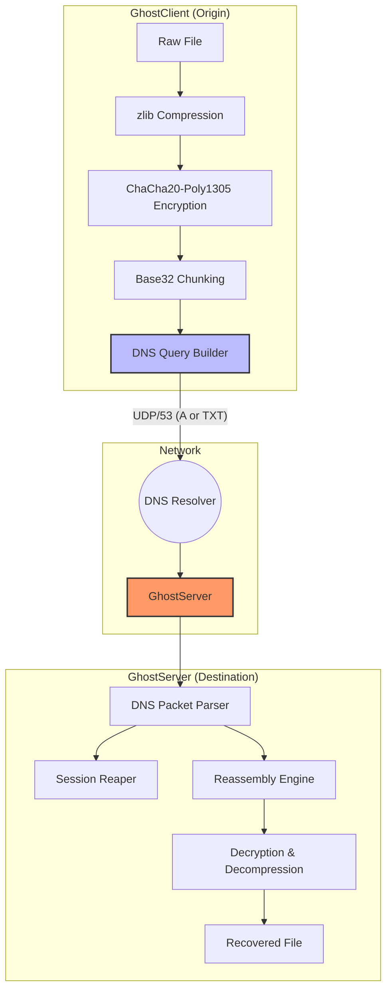

# 👻 GhostNet: Stealthy DNS Tunneling Framework

[](https://github.com/Rakesh-R-K/Ghostnet/actions/workflows/ci.yml)
[](https://opensource.org/licenses/MIT)
[](https://www.python.org/downloads/)
[](https://www.docker.com/)

**GhostNet** is a high-performance, covert file transfer system that tunnels data through standard DNS queries. Designed for security research and offensive/defensive simulation, it demonstrates advanced techniques in protocol encapsulation, authorized exfiltration, and traffic mimicry.

---

## 🏗️ Architecture

GhostNet leverages the DNS protocol's hierarchical structure to encode, encrypt, and transmit data chunks as subdomains.



---

## ✨ Features

### 🔒 Enterprise-Grade Security
- **Authenticated Encryption**: Uses **ChaCha20-Poly1305** for authenticated encryption, ensuring data integrity and confidentiality.
- **Environment Isolation**: Secrets are managed via `.env` files, avoiding hardcoded keys in scripts.

### 🕵️ Stealth & Evasion
- **Protocol Diversification**: Supports tunneling over **A records** and **TXT records**.
- **Randomized Mode**: Interleaves query types to bypass basic signature-based detection.
- **Micro-Delays**: Configurable jitter and delays to break traffic analysis patterns.

### 🛠️ Production-Ready Engineering
- **Session Lifecycle Management**: Built-in **Session Reaper** thread cleans up orphan transfers and prevents memory exhaustion.
- **Structured Observability**: Every event is logged using `structlog` (JSON format), ready for ELK/Prometheus integration.
- **Containerized**: Full Docker and Docker-Compose support for rapid, isolated deployment.

---

## 🚀 Getting Started

### Prerequisites
- Python 3.10+
- Docker (optional)

### Quick Start (Local)

1. **Clone & Install**
   ```bash
   git clone https://github.com/Rakesh-R-K/Ghostnet.git
   cd Ghostnet
   pip install .
   ```

2. **Configure Environments**
   ```bash
   cp .env.example .env
   # Edit .env with your GHOSTNET_ENCRYPTION_KEY
   ```

3. **Deploy Server**
   ```bash
   # Note: Root/Sudo required for port 53
   python -m server.ghostnet_server
   ```

4. **Send Data**
   ```bash
   python -m client.ghostnet_client /path/to/data.pdf --mode RANDOM
   ```

---

## 🐳 Docker Deployment

Simulate a full environment (Server + Client) with a single command:

```bash
docker-compose up --build
```

---

## 🧪 Testing

GhostNet maintains a comprehensive test suite including unit tests for core utilities and end-to-end integration tests.

```bash
pytest tests/ -v
```

---

## 🛡️ Security Disclaimer

This tool is designed for **educational and authorized security testing** only. The author is not responsible for any misuse or damage caused by this software. Use only on systems you own or have explicit permission to test.

---

## 📜 License

Distributed under the MIT License. See `LICENSE` for more information.
